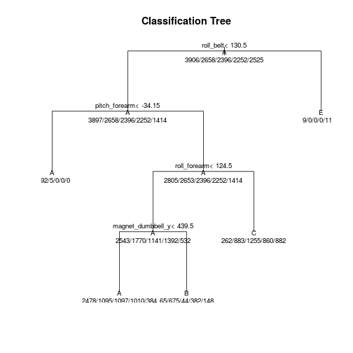
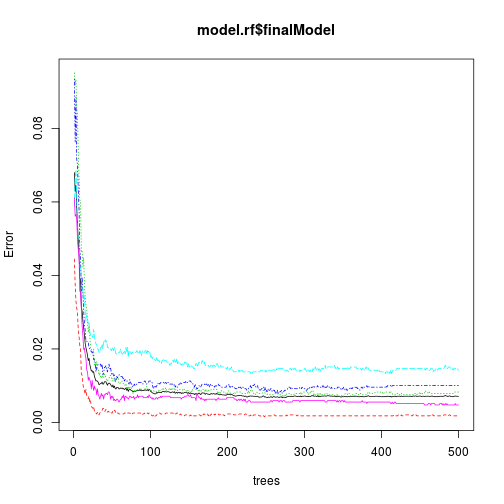

Practical Machine Learning Project (Coursera)
========================================================

Using devices such as Jawbone Up, Nike FuelBand, and Fitbit it is now possible to collect a large amount of data about personal activity relatively inexpensively. These type of devices are part of the quantified self movement – a group of enthusiasts who take measurements about themselves regularly to improve their health, to find patterns in their behavior, or because they are tech geeks. One thing that people regularly do is quantify how much of a particular activity they do, but they rarely quantify how well they do it. In this project, your goal will be to use data from accelerometers on the belt, forearm, arm, and dumbell of 6 participants. They were asked to perform barbell lifts correctly and incorrectly in 5 different ways. More information is available from the website here: http://groupware.les.inf.puc-rio.br/har (see the section on the Weight Lifting Exercise Dataset). 

# Summary

goal: 
- to predict the manner in which people did the exercise ("classe" variable) using any other variables  

steps:
- use cross validation and out-of-sample error estimation
- build prediction models
- compare models
- predict 20 test cases

# Steps

```r
library(caret)
```

```
## Loading required package: lattice
## Loading required package: ggplot2
```

Load data sets

```r
Train <- read.csv("pml-training.csv")
Test <- read.csv("pml-testing.csv")
length(Test)
```

```
## [1] 160
```

Eliminate irrelevant variables (user_name, timestamps, window) and varibles with lot of *NA*s (here with all *NA* in Test set).

```r
NAcols <- which(colSums(!is.na(Test))==0)
irrelevant.names <- c(1:7)
TrainN <- Train[,-c(irrelevant.names, NAcols)]
TestN <- Test[,-c(irrelevant.names, NAcols)]
length(TestN)
```

```
## [1] 53
```
**Note:** the variable *cvtd_timestamp* may be useful if extract information about weekdays and time from it (as seen in previous Data Science courses).


Split the data  (70% for the training data set):

```r
set.seed(23)
inTrain <- createDataPartition(TrainN$classe, p=0.7, list=FALSE)
trainTrainN <- TrainN[inTrain,]
testTrainN <- TrainN[-inTrain,]
```


# Build a Classification Tree

4-fold cross validation used

```r
model.rpart <- train(classe ~ ., data=trainTrainN, method="rpart", 
                     trControl=trainControl(method="cv", number=4, repeats=2))
```

```r
plot(model.rpart$finalModel, uniform=TRUE, main="Classification Tree")
text(model.rpart$finalModel, use.n=TRUE, all=TRUE, cex=.8)
```

 

Predictions

```r
pred.rpart <- predict(model.rpart, testTrainN)
confusionMatrix(pred.rpart, testTrainN$classe)
```

```
## Confusion Matrix and Statistics
## 
##           Reference
## Prediction    A    B    C    D    E
##          A 1511  491  496  446  140
##          B   15  279    9  160   61
##          C  143  369  521  358  361
##          D    0    0    0    0    0
##          E    5    0    0    0  520
## 
## Overall Statistics
##                                           
##                Accuracy : 0.4811          
##                  95% CI : (0.4682, 0.4939)
##     No Information Rate : 0.2845          
##     P-Value [Acc > NIR] : < 2.2e-16       
##                                           
##                   Kappa : 0.322           
##  Mcnemar's Test P-Value : NA              
## 
## Statistics by Class:
## 
##                      Class: A Class: B Class: C Class: D Class: E
## Sensitivity            0.9026  0.24495  0.50780   0.0000  0.48059
## Specificity            0.6265  0.94838  0.74666   1.0000  0.99896
## Pos Pred Value         0.4899  0.53244  0.29737      NaN  0.99048
## Neg Pred Value         0.9418  0.83958  0.87781   0.8362  0.89515
## Prevalence             0.2845  0.19354  0.17434   0.1638  0.18386
## Detection Rate         0.2568  0.04741  0.08853   0.0000  0.08836
## Detection Prevalence   0.5240  0.08904  0.29771   0.0000  0.08921
## Balanced Accuracy      0.7645  0.59666  0.62723   0.5000  0.73978
```

# Build a Random Forest

4-fold cross validation used

```r
set.seed(2015)
model.rf <- train(classe ~ ., data=trainTrainN, method="rf", 
                     trControl=trainControl(method="cv", number=4, repeats=2))
```

```
## Loading required package: randomForest
## randomForest 4.6-10
## Type rfNews() to see new features/changes/bug fixes.
```

```r
plot(model.rf$finalModel)
```

 

Predictions

```r
pred.rf <- predict(model.rf, testTrainN)
confusionMatrix(pred.rf, testTrainN$classe)
```

```
## Confusion Matrix and Statistics
## 
##           Reference
## Prediction    A    B    C    D    E
##          A 1670   15    0    0    0
##          B    3 1123    4    0    2
##          C    1    1 1019    4    0
##          D    0    0    3  959    2
##          E    0    0    0    1 1078
## 
## Overall Statistics
##                                           
##                Accuracy : 0.9939          
##                  95% CI : (0.9915, 0.9957)
##     No Information Rate : 0.2845          
##     P-Value [Acc > NIR] : < 2.2e-16       
##                                           
##                   Kappa : 0.9923          
##  Mcnemar's Test P-Value : NA              
## 
## Statistics by Class:
## 
##                      Class: A Class: B Class: C Class: D Class: E
## Sensitivity            0.9976   0.9860   0.9932   0.9948   0.9963
## Specificity            0.9964   0.9981   0.9988   0.9990   0.9998
## Pos Pred Value         0.9911   0.9920   0.9941   0.9948   0.9991
## Neg Pred Value         0.9990   0.9966   0.9986   0.9990   0.9992
## Prevalence             0.2845   0.1935   0.1743   0.1638   0.1839
## Detection Rate         0.2838   0.1908   0.1732   0.1630   0.1832
## Detection Prevalence   0.2863   0.1924   0.1742   0.1638   0.1833
## Balanced Accuracy      0.9970   0.9920   0.9960   0.9969   0.9980
```

# Out-of-sample error

Out-of-sample error can be estimated 1-Accuracy of cross validation.
Therefore it is:
- for the Classification tree
- for the Random Forest
