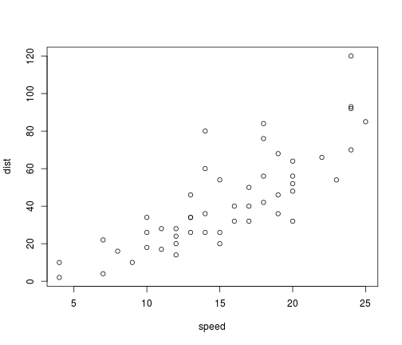

Practical Machine Learning Project (Coursera)
========================================================

Using devices such as Jawbone Up, Nike FuelBand, and Fitbit it is now possible to collect a large amount of data about personal activity relatively inexpensively. These type of devices are part of the quantified self movement – a group of enthusiasts who take measurements about themselves regularly to improve their health, to find patterns in their behavior, or because they are tech geeks. One thing that people regularly do is quantify how much of a particular activity they do, but they rarely quantify how well they do it. In this project, your goal will be to use data from accelerometers on the belt, forearm, arm, and dumbell of 6 participants. They were asked to perform barbell lifts correctly and incorrectly in 5 different ways. More information is available from the website here: http://groupware.les.inf.puc-rio.br/har (see the section on the Weight Lifting Exercise Dataset). 

# Summary

goal: 
- to predict the manner in which people did the exercise ("classe" variable) using any other variables


```r
library(caret)
```

```
## Loading required package: lattice
## Loading required package: ggplot2
```

```r
summary(cars)
```

```
##      speed           dist       
##  Min.   : 4.0   Min.   :  2.00  
##  1st Qu.:12.0   1st Qu.: 26.00  
##  Median :15.0   Median : 36.00  
##  Mean   :15.4   Mean   : 42.98  
##  3rd Qu.:19.0   3rd Qu.: 56.00  
##  Max.   :25.0   Max.   :120.00
```

You can also embed plots, for example:


```r
plot(cars)
```

 

